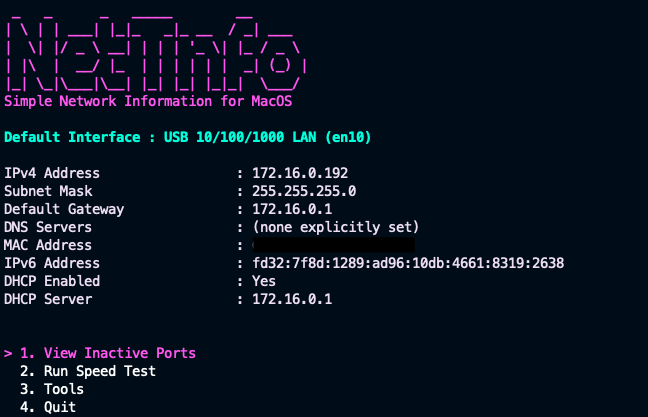

=================================================================================

A clean and simple macOS network diagnostic tool for quickly viewing interface details and running basic tests
- Built-in network quality test (ping, download, upload)
- Basic network tools
- Clean, readable output
- Optional inactive interface view

==== Install (run command) ====

```bash
curl -fsSL https://raw.githubusercontent.com/omenstudio-apps/netinfo/main/install.sh | bash
```
